<div align="center">

# 🏗️ Snappy Switcher Architecture

*A deep dive into how Snappy Switcher processes and displays your windows*

</div>

---

## 📋 Overview

Snappy Switcher is a Wayland window switcher for Hyprland that supports two modes:

| Mode | Description |
|------|-------------|
| **Overview** | Shows all windows individually (like traditional Alt-Tab) |
| **Context** | Intelligently groups tiled windows by "Task" (Workspace + App Class) |

---

## 🔄 Pipeline Architecture

The window handling follows a clear **4-stage pipeline**:

```mermaid
flowchart LR
    subgraph Stage1["📡 Stage 1"]
        F["FETCH\n━━━━━━━━━\nHyprland IPC"]
    end
    
    subgraph Stage2["📊 Stage 2"]
        S["SORT\n━━━━━━━━━\nStable MRU"]
    end
    
    subgraph Stage3["🧩 Stage 3"]
        A["AGGREGATE\n━━━━━━━━━\nContext Mode"]
    end
    
    subgraph Stage4["🎨 Stage 4"]
        R["RENDER\n━━━━━━━━━\nCairo UI"]
    end

    F --> S --> A --> R

    style F fill:#89b4fa,stroke:#1e1e2e,color:#1e1e2e
    style S fill:#a6e3a1,stroke:#1e1e2e,color:#1e1e2e
    style A fill:#f9e2af,stroke:#1e1e2e,color:#1e1e2e
    style R fill:#cba6f7,stroke:#1e1e2e,color:#1e1e2e
```



---

## 📡 Stage 1: Fetch (Hyprland IPC)

**File**: [`src/hyprland.c`](../src/hyprland.c) → `parse_clients_json()`

```mermaid
sequenceDiagram
    participant D as Daemon
    participant S as Hyprland Socket
    participant H as Hyprland

    D->>S: Connect to $XDG_RUNTIME_DIR/hypr/$SIGNATURE/.socket.sock
    D->>H: Send "j/clients"
    H-->>D: JSON Response
    
    Note over D: Parse window data

    rect rgb(49, 50, 68)
        Note over D: Extract per window:<br/>• address (unique ID)<br/>• title<br/>• class (app name)<br/>• workspace.id<br/>• focusHistoryID<br/>• floating (bool)
    end
```



**Extracted Fields:**

| Field | Type | Description |
|-------|------|-------------|
| `address` | `string` | Unique window identifier (hex) |
| `title` | `string` | Window title text |
| `class` | `string` | App class name (e.g., `kitty`, `firefox`) |
| `workspace.id` | `int` | Workspace number |
| `focusHistoryID` | `int` | MRU position (0 = most recent) |
| `floating` | `bool` | Tiled or floating window |

---

## 📊 Stage 2: Sort (Stable MRU)

**File**: [`src/hyprland.c`](../src/hyprland.c) → `compare_by_focus_history()`

```mermaid
flowchart TB
    subgraph Input["Unsorted Windows"]
        W1["Window A\nfocusID: 3"]
        W2["Window B\nfocusID: 1"]
        W3["Window C\nfocusID: 1"]
        W4["Window D\nfocusID: 0"]
    end
    
    subgraph Sort["Sorting Logic"]
        P["Primary: focusHistoryID ↑\n(lower = more recent)"]
        T["Tie-breaker: address ↔\n(alphabetical)"]
    end
    
    subgraph Output["Sorted Windows"]
        S1["🥇 Window D (ID: 0)"]
        S2["🥈 Window B (ID: 1)"]
        S3["🥉 Window C (ID: 1)"]
        S4["4️⃣ Window A (ID: 3)"]
    end
    
    Input --> Sort --> Output

    style P fill:#a6e3a1,stroke:#1e1e2e,color:#1e1e2e
    style T fill:#89b4fa,stroke:#1e1e2e,color:#1e1e2e
```



**Sorting Algorithm:**

```c
int diff = wa->focus_history_id - wb->focus_history_id;
if (diff != 0) return diff;
return strcmp(wa->address, wb->address);  // Stable tie-breaker
```

---

## 🧩 Stage 3: Aggregate (Context Mode)

**File**: [`src/hyprland.c`](../src/hyprland.c) → `aggregate_context_windows()`

> ⚠️ **Only runs when** `config->mode == MODE_CONTEXT`

### Aggregation Rules

```mermaid
flowchart TD
    W["Window"]
    
    W --> Q{Is Floating?}
    
    Q -->|Yes| FLOAT["🔳 Keep as UNIQUE card\n(Never grouped)"]
    Q -->|No| TILED["Check existing groups"]
    
    TILED --> Q2{Same class +\nworkspace exists?}
    
    Q2 -->|Yes| INC["➕ Increment group_count"]
    Q2 -->|No| NEW["📦 Create NEW group\n(This window = 'face')"]

    style FLOAT fill:#f38ba8,stroke:#1e1e2e,color:#1e1e2e
    style INC fill:#a6e3a1,stroke:#1e1e2e,color:#1e1e2e
    style NEW fill:#89b4fa,stroke:#1e1e2e,color:#1e1e2e
```



### Visual Example

```mermaid
graph LR
    subgraph Before["Raw MRU List"]
        B1["kitty\nWS:1, tiled"]
        B2["firefox\nWS:2, floating"]
        B3["kitty\nWS:1, tiled"]
        B4["kitty\nWS:1, tiled"]
        B5["code\nWS:2, tiled"]
    end
    
    subgraph After["After Aggregation"]
        A1["🔲 kitty × 3\nWS:1"]
        A2["🔳 firefox\nWS:2 (floating)"]
        A3["🔲 code\nWS:2"]
    end
    
    Before -->|"Group tiled\nPreserve floating"| After

    style A1 fill:#313244,stroke:#89b4fa,color:#cdd6f4
    style A2 fill:#45475a,stroke:#f38ba8,color:#cdd6f4
    style A3 fill:#313244,stroke:#89b4fa,color:#cdd6f4
```



| Window Type | Behavior |
|-------------|----------|
| **Floating** | ❌ NEVER grouped — always unique card |
| **Tiled** | ✅ Grouped by `workspace_id + class_name` |

---

## 🎨 Stage 4: Render (Cairo UI)

**File**: [`src/render.c`](../src/render.c)


**Rendering Features:**

| Feature | Description |
|---------|-------------|
| **Grid Layout** | Dynamic columns up to `max_cols` |
| **Stack Effect** | Shadow cards behind grouped windows |
| **Badge Pill** | Bottom-right count badge for groups |
| **Selection Glow** | Highlighted border on selected card |

---

## 📦 Data Structures

### WindowInfo

**File**: [`src/data.h`](../src/data.h)


```c
typedef struct {
  char *address;        // Window address (hex)
  char *title;          // Window title
  char *class_name;     // App class name
  int workspace_id;     // Workspace number
  int focus_history_id; // MRU position
  bool is_active;       // Currently focused?
  bool is_floating;     // Floating or tiled?
  int group_count;      // Number of windows in group
} WindowInfo;
```

### Config

**File**: [`src/config.h`](../src/config.h)

```c
typedef enum { MODE_OVERVIEW, MODE_CONTEXT } ViewMode;

typedef struct {
  ViewMode mode;        // Overview or Context
  int max_cols;         // Grid column limit
  char icon_theme[64];  // Icon theme name
  // ... colors, dimensions
} Config;
```

---

## 🖼️ Icon Loading

**File**: [`src/icons.c`](../src/icons.c)

```mermaid
flowchart TD
    START["App Class Name\n(e.g., 'firefox')"]
    
    START --> DESK["🔍 Search .desktop file"]
    DESK --> ICON["📄 Extract Icon= value"]
    
    ICON --> THEME["Search Icon Themes"]
    
    subgraph ThemeSearch["Theme Priority"]
        T1["1️⃣ Primary Theme"]
        T2["2️⃣ Fallback Theme"]
        T3["3️⃣ hicolor"]
        T4["4️⃣ Adwaita"]
    end
    
    THEME --> ThemeSearch
    
    ThemeSearch --> Q{Found?}
    
    Q -->|Yes| LOAD["📥 Load PNG/SVG"]
    Q -->|No| LETTER["🔤 Generate Letter Icon"]
    
    LOAD --> DONE["✅ Return Icon Surface"]
    LETTER --> DONE

    style T1 fill:#89b4fa,stroke:#1e1e2e,color:#1e1e2e
    style T2 fill:#a6e3a1,stroke:#1e1e2e,color:#1e1e2e
    style T3 fill:#f9e2af,stroke:#1e1e2e,color:#1e1e2e
    style T4 fill:#fab387,stroke:#1e1e2e,color:#1e1e2e
```



---

## 🔧 Daemon Architecture

**File**: [`src/main.c`](../src/main.c)

```mermaid
flowchart TB
    subgraph Daemon["Snappy Daemon Process"]
        INIT["🚀 Initialize"]
        INIT --> LOCK["🔒 Acquire Socket Lock\n/tmp/snappy-switcher.sock"]
        LOCK --> WL["🌊 Connect Wayland\n(Layer Shell)"]
        WL --> LOOP["♻️ Event Loop"]
        
        subgraph EventLoop["poll() Event Loop"]
            FD1["📡 Wayland FD"]
            FD2["🔌 Socket FD"]
        end
        
        LOOP --> EventLoop
        
        EventLoop --> CMD["Process Command"]
        CMD --> LOOP
    end
    
    subgraph Client["Client Process"]
        C["snappy-switcher next"]
    end
    
    Client -->|"Unix Socket"| FD2

    style LOCK fill:#f38ba8,stroke:#1e1e2e,color:#1e1e2e
    style WL fill:#89b4fa,stroke:#1e1e2e,color:#1e1e2e
    style LOOP fill:#a6e3a1,stroke:#1e1e2e,color:#1e1e2e
```



### Available Commands

| Command | Description |
|---------|-------------|
| `next` | Cycle to next window |
| `prev` | Cycle to previous window |
| `toggle` | Show/hide switcher |
| `hide` | Force hide overlay |
| `select` | Confirm current selection |
| `quit` | Stop the daemon |

---

## 📁 File Overview


---

<div align="center">

**[← Back to README](../README.md)** · **[Configuration Guide →](CONFIGURATION.md)**

</div>
